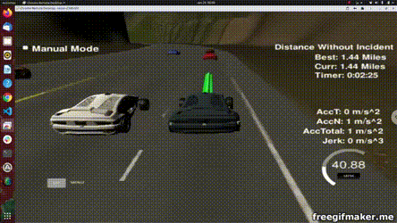

# Self Driving Car Path Planning Project

## Old README
The Old README.md file is renamed as [Readme.old.md](README.old.md)

## Video
Youtube video link https://youtu.be/axl83BoeHD8 .



### How to use
- Download and Open the term 3 simulator. The link is provided in the old readme file.
- Run the following commands to build the binary file
```bash
cd build && cmake .. && make
```
- Then run the binary named `path_planning`
```bash
./path_planning
``` 


## Reflection
The reflection on the code, i.e. the code structure is described in [Reflection.md](Reflection.md) file. 

### Ways of Improvement

- Use a Data-driven approach along with the model-driven approach to predict the cars in each lane at each iteration. Right now, the prediction is based on a simple kinematic model. Using a Machine learning-based method would improve the lane choice.

- Sometimes the car gets confused in the middle of a lane change. The lane change should be made more robust to avoid such situations.

- Choose the best lane. Currently, by default, the car prefers the left lane over the right lane. But it should be based on available cars and their distances in each lane.

- Use of Reinforcement learning. If we can model the environment as an MDP, we can try to use Reinforcement learning as well.

- Add unit tests and integration tests for robust coding